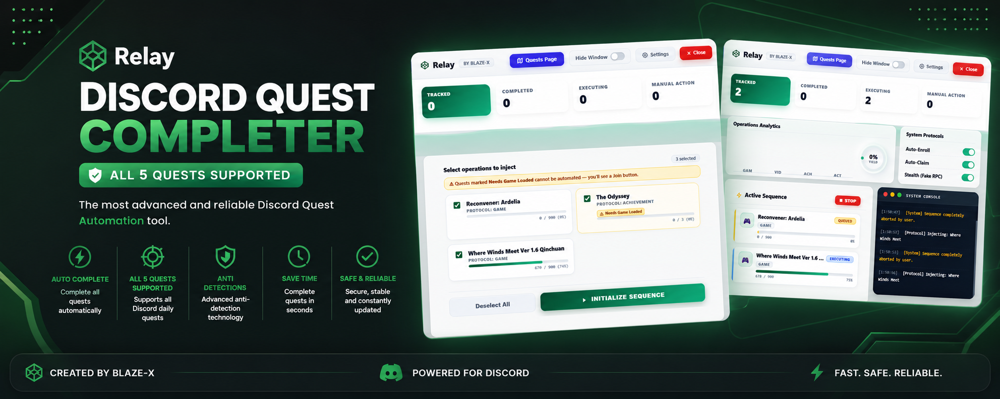
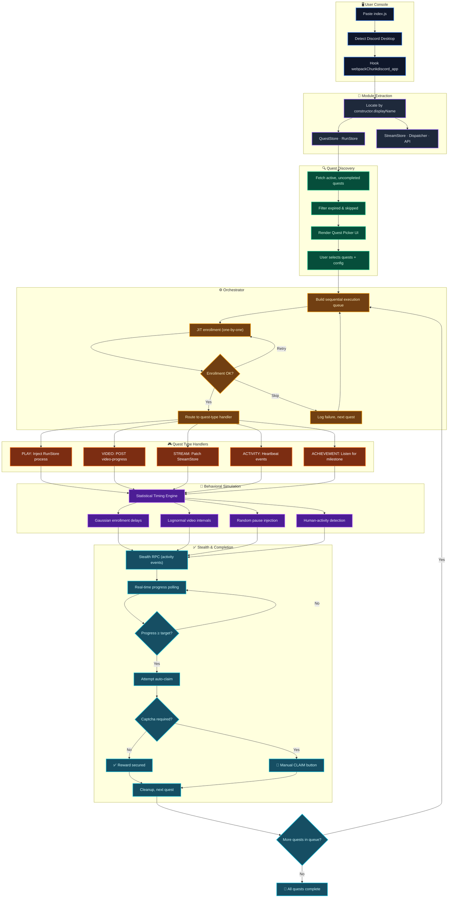
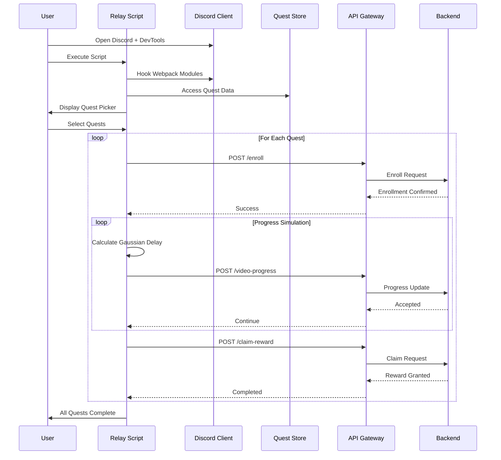
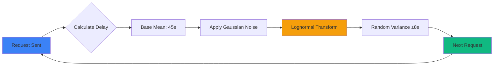

<div align="center">



<br />

# Relay

### Advanced Discord Quest Automation Framework

<sub>Developed by <a href="https://github.com/blaze0089"><strong>BLAZE-X</strong></a> &nbsp;·&nbsp; Release <code>v1.0.0-phantom</code></sub>

<br />

[](https://github.com/blaze0089/Discord-Quest-Completer)
[](LICENSE)
[](https://discord.com/download)
[](https://github.com/blaze0089/Discord-Quest-Completer/stargazers)

<br />

**A behavioral simulation engine for Discord Quest completion**

Relay employs statistical timing models and human activity patterns to complete Discord Quests through Discord's internal APIs. Single-paste execution. No external dependencies.

<br />

[**Quick Start**](#-quick-start) · [**Features**](#-features) · [**Architecture**](#-system-architecture) · [**Configuration**](#-configuration) · [**FAQ**](#-faq)

<br />

</div>

---

## 📋 Table of Contents

- [Overview](#overview)
- [Quick Start](#-quick-start)
- [Features](#-features)
- [System Architecture](#-system-architecture)
- [Quest Types](#-quest-types)
- [User Interface](#-user-interface)
- [Configuration](#-configuration)
- [Troubleshooting](#-troubleshooting)
- [FAQ](#-faq)
- [Best Practices](#-best-practices)
- [Contributing](#-contributing)
- [License](#-license)

---

## Overview

Relay is a client-side automation framework designed for Discord Quest completion. It operates entirely within your authenticated Discord session, utilizing Discord's native webpack module system and internal API endpoints. No token extraction, no external servers, no installations required.

The framework implements adaptive timing strategies based on statistical distributions to simulate natural user behavior patterns, making automated quest completion indistinguishable from manual interaction.

### Key Capabilities

- **Universal Quest Support** - Handles all five Discord Quest types: GAME, VIDEO, STREAM, ACTIVITY, and ACHIEVEMENT
- **Intelligent Timing Engine** - Employs lognormal and Gaussian distributions for realistic timing intervals
- **Adaptive Behavior** - Monitors actual user activity and adjusts automation patterns accordingly
- **Interactive Dashboard** - Real-time progress tracking with native Discord UI styling
- **Zero Configuration** - Works out-of-the-box with sensible defaults
- **Fault Tolerance** - Gracefully handles API failures, rate limits, and network issues

---

## ⚡ Quick Start

> **System Requirements**
> - Discord Desktop client (required for GAME and STREAM quests)
> - Developer Tools access (enabled by default on Canary/PTB)

### Installation

**Step 1:** Launch [Discord Desktop](https://discord.com/download)

**Step 2:** Open Developer Console
- **Windows/Linux:** `Ctrl + Shift + I`
- **macOS:** `Cmd + Option + I`

**Step 3:** Navigate to the **Console** tab

**Step 4:** Paste the complete contents of `index.js` and press **Enter**

The Relay Quest Picker will launch automatically. Select your desired quests, configure settings, and click **START** to begin automation.

<br />

### Enabling DevTools on Discord Stable

<details>
<summary>Click to expand instructions</summary>

<br />

1. **Close Discord completely**

2. **Locate your settings file:**

   | Operating System | File Path |
   |-----------------|-----------|
   | Windows | `%appdata%\discord\settings.json` |
   | macOS | `~/Library/Application Support/discord/settings.json` |
   | Linux | `~/.config/discord/settings.json` |

3. **Edit the JSON file** and add this property:

   ```json
   {
     "DANGEROUS_ENABLE_DEVTOOLS_ONLY_ENABLE_IF_YOU_KNOW_WHAT_YOURE_DOING": true
   }
   ```

4. **Save the file** and restart Discord

Developer Tools are now accessible via `Ctrl + Shift + I`.

</details>

<br />

### Compatibility with Client Modifications

<details>
<summary>Vencord and BetterDiscord Support</summary>

<br />

Relay operates independently of client modifications. If Vencord is detected, Relay will automatically utilize its Webpack API for enhanced module resolution on Discord Stable builds. BetterDiscord is fully compatible without additional configuration.

**No setup required for either modification.**

</details>

---

## ✨ Features

### Behavioral Simulation

Relay implements multiple layers of behavioral modeling to replicate natural user patterns:

- **Variable Timing Intervals** - Uses statistical distributions rather than fixed delays
- **Activity-Aware Scheduling** - Detects mouse and keyboard events to extend delays during active use
- **Dynamic Pause Injection** - Randomly inserts idle periods to simulate user breaks
- **Progressive Abandonment** - Increases skip probability after repeated failures
- **Captcha Handling** - Provides interactive fallback when automated claiming is blocked

### Technical Implementation

- **Module Extraction** - Resilient webpack store detection using constructor signatures
- **JIT Enrollment** - Enrolls quests individually before execution to minimize detection surface
- **Sequential Processing** - Executes quests one at a time to avoid parallel request patterns
- **Exponential Backoff** - Intelligent retry logic for rate limits and server errors
- **Clean Teardown** - Properly releases resources and removes injected elements on shutdown

### User Experience

- **Visual Quest Picker** - Color-coded interface for quest selection and filtering
- **Live Progress Dashboard** - Draggable overlay with real-time status updates
- **Desktop Notifications** - Audio and visual alerts on quest completion
- **In-Dashboard Claiming** - Interactive buttons for manual claim when captcha is required
- **Keyboard Toggle** - `Shift + .` to show/hide dashboard

---

## 🏗 System Architecture

Relay implements a sophisticated multi-layer pipeline architecture with behavioral simulation and fault-tolerant execution:



### Architecture Highlights

**🔄 Pipeline Flow**
1. **Bootstrap** → Extracts Discord's internal webpack modules and initializes statistical engine
2. **Selection** → Interactive UI for quest configuration and settings
3. **Orchestration** → Sequential JIT enrollment with intelligent queuing
4. **Execution** → Type-specific handlers for each quest category
5. **Simulation** → Multi-layer behavioral modeling with activity awareness
6. **Monitoring** → Real-time progress tracking with dashboard updates
7. **Completion** → Automatic claiming with captcha fallback

**🛡️ Resilience Features**
- Constructor-based module detection (survives webpack reshuffles)
- Exponential backoff for rate limits and server errors
- Fault-tolerant execution (isolated task failures)
- Human activity detection for adaptive timing
- Skip-list for permanently failed quests

### Execution Flow



### Timing Strategy

Relay uses **Lognormal Distribution** for realistic behavior simulation:



**Statistical Properties:**
- **Mean Interval:** 45 seconds (configurable)
- **Standard Deviation:** 8 seconds
- **Distribution:** Log-Normal for natural variance

---


## 🎯 Quest Types

Relay supports all five Discord Quest categories. Each type uses a different execution strategy:

### 🎮 GAME Quests

**What Relay Does:**
- Injects a simulated game process into Discord's RunStore
- Generates Windows NT-compliant Process IDs (multiples of 4)
- Dispatches Rich Presence events to maintain "Playing" status
- Monitors quest progress through Discord's internal progress API

**Requirements:**
- Discord Desktop client
- Quest must be enrolled before execution

**Example Flow:**
```
Enroll Quest → Inject RunStore → Dispatch RPC → Wait for Progress → Clean Up
```

---

### 📺 VIDEO Quests

**What Relay Does:**
- Sends simulated video progress timestamps to Discord's video-progress endpoint
- Uses lognormal-distributed intervals between progress updates
- Employs 6-decimal precision floats matching native video player behavior
- Adapts timing based on detected user activity

**Requirements:**
- Any Discord client (Desktop, Web, Mobile)

**Example Flow:**
```
Enroll Quest → Send Progress (0%) → Wait (Lognormal Delay) → Send Progress (X%) 
→ Repeat Until 100% → Complete
```

---

### 🎬 STREAM Quests

**What Relay Does:**
- Patches StreamStore's metadata getter with synthetic stream information
- Simulates active streaming session
- Maintains stream metadata for quest duration

**Requirements:**
- Discord Desktop client

**Example Flow:**
```
Enroll Quest → Patch StreamStore → Monitor Progress → Restore Original → Complete
```

---

### 🎤 ACTIVITY Quests

**What Relay Does:**
- Fires heartbeat events to voice channel dispatcher
- Simulates active participation in voice activities
- Maintains connection signals for quest duration

**Requirements:**
- Any Discord client

**Example Flow:**
```
Enroll Quest → Send Heartbeat → Wait → Repeat → Monitor Progress → Complete
```

---

### 🏆 ACHIEVEMENT Quests

**What Relay Does:**
- Registers listener for ACHIEVEMENT_IN_ACTIVITY events
- Monitors Discord's event dispatcher for completion signals
- Automatically detects when achievement is earned in activity

**Requirements:**
- Discord Desktop client
- **Manual action required:** User must join the activity manually once

**Example Flow:**
```
Enroll Quest → Wait for Manual Join → Listen for Achievement Event → Complete
```

---

## 🎨 User Interface

### Quest Picker

The Quest Picker appears automatically when Relay is initialized. It provides:

- **Visual Quest Cards** - Each quest displays name, description, and reward type
- **Color-Coded Rewards** - Gold for Orbs, Purple for Avatar Decorations, Blue for In-Game Items
- **Filter Pills** - Toggle entire reward categories on/off
- **Quest Type Filters** - Show/hide based on quest category (GAME, VIDEO, etc.)
- **Select/Deselect All** - Bulk selection controls
- **Configuration Panel** - Toggle auto-enrollment, auto-claiming, and stealth features

### Progress Dashboard

The dashboard is a draggable overlay that shows:

- **Task Cards** - One per active/completed quest
- **Live Progress Bars** - Circular progress indicators with percentage
- **Status Icons** - Visual indicators for Running, Queued, Completed, or Failed states
- **Action Buttons** - Interactive CLAIM REWARD buttons when manual action is needed
- **Console Log** - Recent system messages and errors
- **Control Buttons** - STOP button to halt all execution

**Keyboard Shortcut:** Press `Shift + .` to toggle dashboard visibility

### Task Card States

| State | Visual Indicator | Description |
|-------|-----------------|-------------|
| **Running** | Blue accent, animated progress | Quest is actively executing |
| **Queued** | Orange accent, static | Quest is waiting to start |
| **Completed** | Green checkmark | Quest finished successfully |
| **Action Required** | Yellow button | Manual interaction needed (captcha/join activity) |
| **Failed** | Red X | Quest encountered unrecoverable error |

---

## ⚙ Configuration

### Default Settings

Relay ships with pre-configured defaults optimized for safety and reliability:

```javascript
{
  autoEnroll: true,      // Automatically enroll in quests before execution
  autoClaim: true,       // Attempt automatic reward claiming
  playSound: false,      // Play audio notification on completion
  stealthRPC: true       // Enable Rich Presence activity simulation
}
```

### Modifying Settings

Settings can be configured through the Quest Picker UI before starting execution. Changes persist for the current session only.

**Available Options:**

- **Auto-Enroll** - When enabled, Relay automatically enrolls in quests just before execution. When disabled, you must enroll manually through Discord's UI before running Relay.

- **Auto-Claim** - When enabled, Relay attempts to claim rewards automatically upon quest completion. If a captcha is required, a manual CLAIM button appears on the task card.

- **Play Sound** - Enables audio notifications. A single tone plays on quest completion; a three-note arpeggio plays when all quests finish.

- **Stealth RPC** - Injects Rich Presence activity updates to make your session appear actively engaged with applications during quest execution.

### Timing Parameters

Timing is controlled by internal statistical distributions. **Modifying timing constants is strongly discouraged** as they are calibrated for behavioral authenticity.

If you must adjust timing:
- Only increase values, never decrease
- Understand that faster execution correlates with higher detection risk
- Test changes on a secondary account first

---

## 🔧 Troubleshooting

### Common Issues and Solutions

<details>
<summary><strong>Script does nothing after pasting</strong></summary>

<br />

**Possible Causes:**
- DevTools may be disabled
- JavaScript errors in console
- Another instance is already running

**Solutions:**
1. Check for error messages in the console (red text)
2. Verify DevTools is enabled ([see instructions](#enabling-devtools-on-discord-stable))
3. Refresh Discord (`Ctrl + R`) and paste again
4. Ensure you pasted the **complete** file contents

</details>

<details>
<summary><strong>Quest Picker shows no quests</strong></summary>

<br />

**Possible Causes:**
- QuestStore hasn't loaded
- No active quests in your region
- Module extraction failed

**Solutions:**
1. Navigate to Discord's Quest Home page before pasting the script
2. Verify quests are visible in Discord's native UI
3. Check console for extraction errors
4. Refresh and retry

</details>

<details>
<summary><strong>VIDEO quest stuck at 0%</strong></summary>

<br />

**Possible Causes:**
- API endpoint changed
- Rate limiting active on your session
- Network connectivity issue

**Solutions:**
1. Check console for HTTP error codes
2. If rate-limited (429 errors), wait 30-60 minutes
3. Verify the task card shows "Running" state (blue accent)
4. Check network connectivity

</details>

<details>
<summary><strong>Auto-claim fails / Shows captcha required</strong></summary>

<br />

**Expected Behavior:**
Discord periodically requires manual captcha verification for security. This is normal.

**Solution:**
Click the **CLAIM REWARD** button that appears on the task card to complete captcha manually. The quest is already finished; this is just the final claiming step.

</details>

<details>
<summary><strong>Dashboard disappeared or is off-screen</strong></summary>

<br />

**Solutions:**
- Press `Shift + .` to toggle visibility
- If off-screen, refresh Discord to reset position
- Re-paste script if dashboard doesn't appear at all

</details>

<details>
<summary><strong>Does Relay work after Discord updates?</strong></summary>

<br />

**Short Answer:** Usually yes.

Relay uses resilient module detection based on constructor names rather than hardcoded webpack paths. This approach survives most Discord updates that only reshuffle minified code.

Major API-level changes may require a Relay update. Check the repository after significant Discord releases.

</details>

<details>
<summary><strong>Compatible with Vencord or BetterDiscord?</strong></summary>

<br />

**Yes, fully compatible.**

Relay is a standalone script. It will automatically detect and utilize Vencord's Webpack API if present, which can improve compatibility on Discord Stable builds. BetterDiscord works without any special configuration.

Neither modification is required.

</details>

---

## ❓ FAQ

<details>
<summary><strong>Can I run Relay on multiple accounts simultaneously?</strong></summary>

<br />

**Not recommended.**

Running automation on multiple accounts at the same time creates correlated request patterns that are more easily detected. 

If you need to use multiple accounts:
- Space executions several hours apart
- Use Discord normally between automation runs
- Vary the quests you complete on each account

</details>

<details>
<summary><strong>Does Relay work on Discord Web or Mobile?</strong></summary>

<br />

**Partial support:**

- **GAME and STREAM quests** require Discord Desktop - they depend on desktop-specific APIs
- **VIDEO and ACTIVITY quests** may function in browser DevTools, but this is untested
- **Mobile** is not supported

For full quest type coverage, use Discord Desktop.

</details>

<details>
<summary><strong>What is the statistical timing engine?</strong></summary>

<br />

Relay uses mathematical probability distributions to model human behavior:

- **Lognormal distribution** for video progress intervals (mimics reaction time variability)
- **Gaussian distribution** for enrollment delays (models decision-making time)
- **Random pause injection** (simulates natural idle breaks)
- **Activity-aware delay extension** (extends waits during active Discord use)

These create timing patterns that closely match genuine human interaction, making automation difficult to distinguish from manual completion.

</details>

<details>
<summary><strong>Can I customize the timing?</strong></summary>

<br />

**Technically possible, practically inadvisable.**

The timing constants are calibrated across multiple statistical distributions specifically for behavioral realism. Reducing values trades safety for speed.

If you must modify timing:
- Only increase values, never decrease
- Understand that faster execution increases detection risk
- Test thoroughly on a secondary account
- Accept full responsibility for any consequences

</details>

<details>
<summary><strong>What does Stealth RPC do?</strong></summary>

<br />

Stealth RPC dispatches `LOCAL_ACTIVITY_UPDATE` events into Discord's internal activity system while quests run. This makes your session appear to be actively using an application (similar to showing "Playing a game" status), adding a layer of session authenticity beyond just timing simulation.

You can disable it in the Quest Picker if you prefer minimal footprint.

</details>

---

## 🛡 Best Practices

### Recommended Usage Pattern

**Start conservatively and scale gradually:**

```
Day 1   →  Run 1 VIDEO quest. Wait 24 hours. Monitor for issues.
Day 3   →  Run 2 quests of different types. Wait 24-48 hours.
Day 7   →  Scale to 3-4 quests. Continue monitoring.
Ongoing →  Vary schedule. Never create predictable patterns.
```

### Do This

✅ Start with VIDEO quests (smallest API surface)  
✅ Use Discord normally while Relay runs  
✅ Complete some quests manually (never automate 100%)  
✅ Test on a secondary account first  
✅ Monitor console output during execution  
✅ Space out automation sessions  

### Avoid This

❌ Decreasing any timing constant  
❌ Running immediately after Discord updates  
❌ Automating multiple accounts simultaneously  
❌ Running the same quests at the same time daily  
❌ Automating every single available quest  
❌ Ignoring console warnings or errors  

---

## 🤝 Contributing

Contributions are welcome for bug reports, compatibility improvements, and documentation enhancements.

### Development Setup

```bash
git clone https://github.com/blaze0089/Discord-Quest-Completer.git
cd Discord-Quest-Completer

# No build process required - pure JavaScript
# Edit index.js and test via Discord Desktop DevTools Console
```

### Contribution Guidelines

**Before submitting a pull request:**

- Test on both Discord Stable and Canary builds
- Maintain or improve behavioral realism (no shortcuts to speed)
- Follow existing code style and ES6+ conventions
- Update README if your changes affect documented behavior
- Write clear, descriptive commit messages

**When reporting bugs, include:**

- Discord version (Stable / PTB / Canary)
- Operating system
- Complete error output from DevTools console
- Steps to reproduce the issue
- Whether Vencord or BetterDiscord is installed

---

## ⚖ Disclaimer

This project is provided **strictly for educational and research purposes** to demonstrate client-side automation techniques, behavioral simulation methodologies, and API interaction patterns.

**Important Notices:**

- Automating user actions may violate Discord's Terms of Service
- The developer assumes no responsibility for account actions taken by Discord
- Use of this software is entirely at your own risk
- No automation tool can guarantee detection immunity
- Users are solely responsible for consequences of use

```
THE SOFTWARE IS PROVIDED "AS IS", WITHOUT WARRANTY OF ANY KIND, EXPRESS OR
IMPLIED, INCLUDING BUT NOT LIMITED TO THE WARRANTIES OF MERCHANTABILITY,
FITNESS FOR A PARTICULAR PURPOSE AND NONINFRINGEMENT.
```

By using Relay, you acknowledge understanding these terms and accept full responsibility for any outcomes.

---

## 📄 License

```
MIT License - Copyright (c) 2026 BLAZE-X

Permission is hereby granted, free of charge, to any person obtaining a copy
of this software and associated documentation files (the "Software"), to deal
in the Software without restriction, including without limitation the rights
to use, copy, modify, merge, publish, distribute, sublicense, and/or sell
copies of the Software, and to permit persons to whom the Software is
furnished to do so, subject to the following conditions:

The above copyright notice and this permission notice shall be included in
all copies or substantial portions of the Software.
```

[View Full License →](LICENSE)

---

<div align="center">

<br />

**Developed by [BLAZE-X](https://github.com/blaze0089)**

<br />

[](https://github.com/blaze0089/Discord-Quest-Completer/stargazers)
&nbsp;&nbsp;
[](https://github.com/blaze0089/Discord-Quest-Completer/network)
&nbsp;&nbsp;
[](https://github.com/blaze0089/Discord-Quest-Completer/issues)

<br />

<sub>Discord is a registered trademark of Discord Inc. This project is not affiliated with, endorsed by, or sponsored by Discord Inc.</sub>

<br />

</div>
